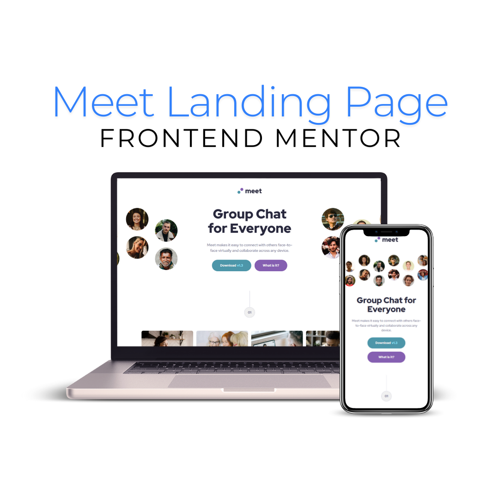

# Frontend Mentor - Meet landing page solution

This is a solution to the [Meet landing page challenge on Frontend Mentor](https://www.frontendmentor.io/challenges/meet-landing-page-rbTDS6OUR). Frontend Mentor challenges help you improve your coding skills by building realistic projects.

## Table of contents

- [Frontend Mentor - Meet landing page solution](#frontend-mentor---meet-landing-page-solution)
  - [Table of contents](#table-of-contents)
  - [Overview](#overview)
    - [Screenshot](#screenshot)
    - [Links](#links)
  - [My process](#my-process)
    - [Built with](#built-with)
    - [What I learned](#what-i-learned)
    - [Continued development](#continued-development)
  - [Author](#author)
  - [Acknowledgments](#acknowledgments)

## Overview

### Screenshot

### Links

- Solution URL: [GitHub](https://github.com/brunagoncalves/meet-landing-page)
- Live Site URL: [Add live site URL here](https://your-live-site-url.com)

## My process

### Built with

- Semantic HTML5 markup
- CSS custom properties
- Flexbox
- CSS Grid
- Mobile-first workflow
- Scss

### What I learned

I gained more experience in structuring responsive layouts.

### Continued development

Moving forward, I aim to further enhance my skills in responsive design by mastering advanced layout techniques like CSS Grid and improving my approach to handling images for various screen sizes. I also want to explore optimizing images for better performance and learn about modern accessibility practices, such as implementing ARIA roles and landmarks for better user experience. Another area of focus will be improving my debugging workflow to efficiently tackle layout issues like overflow and alignment problems.

## Author

- Website - [brunagoncalves.me](https://brunagoncalves.me)
- Frontend Mentor - [@brunagoncalves](https://www.frontendmentor.io/profile/brunagoncalves)
- Twitter - [@BruhnaGoncalves](https://twitter.com/BruhnaGoncalves)

## Acknowledgments

Thanks to Frontend Mentor for the challenge, which is a great platform for practicing web development skills through real-world projects.
